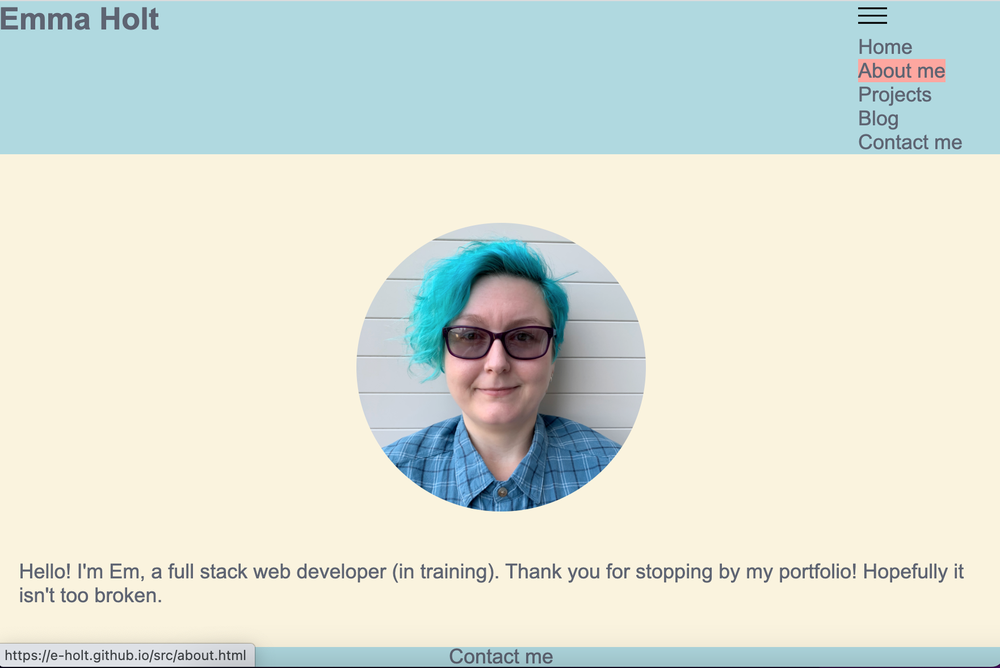
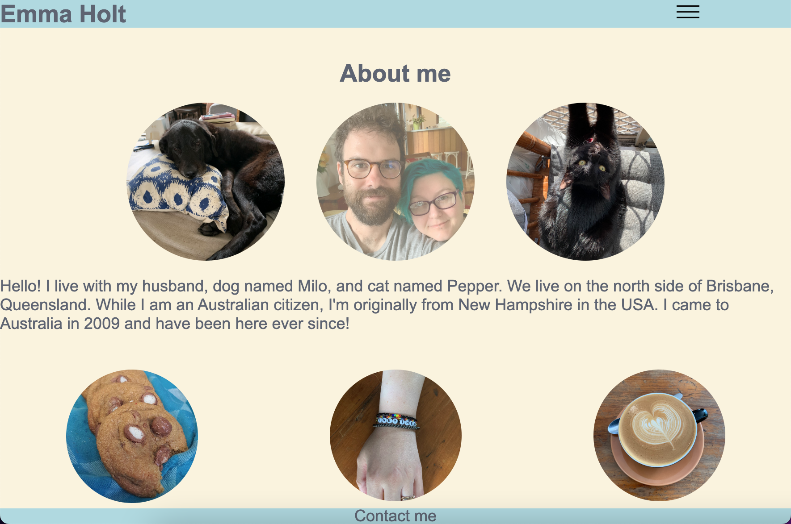
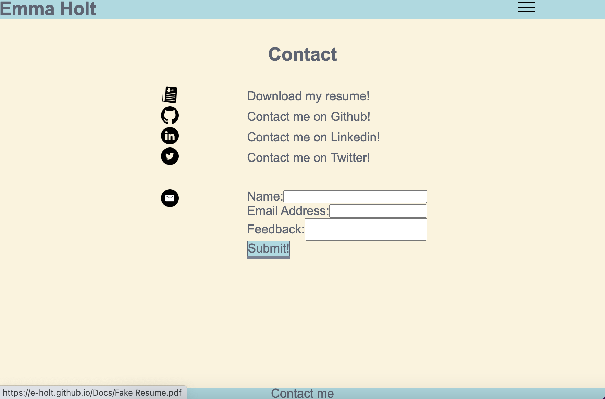
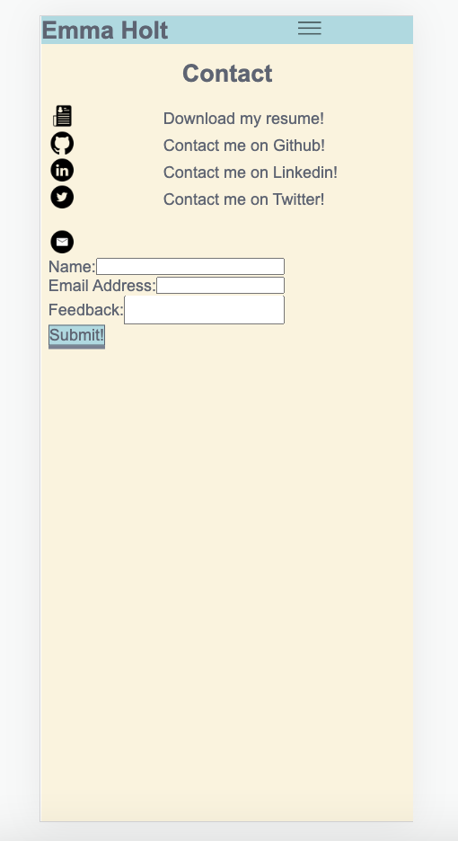
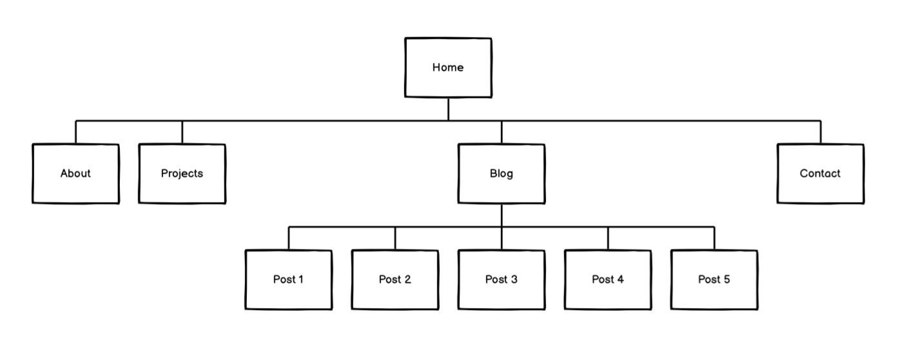

## T1A2 Portfolio Assignment

My portfolio website can be found at https://e-holt.github.io/src/index.html 

My Github repository can be found at https://github.com/E-Holt/E-Holt.github.io

Description:
The purpose of this website is to showcase my eventual skills to potential employers and document my increasing knowledge over time. It also serves as a way to practice skills, experiment, and work on using multiple markup, styling, and eventually coding languages together. The audience currently are my lecturers, but eventually will be future employers and/or clients. 

This website is responsive and semantically correct utilising flexbox and semantically appropriate HTML. It features a congruent colour theme and break points on pages where they would be beneficial. It also features some styling to add interactivity and make it more interesting to the audience. 

These include:

Styling links to be highlighted a different colour when hovered over, with a short transition animation.

Opacity change when hovering over images.

Animated icons on the contact page. 

Header/footer changes depending on the media breakpoints.

Sitemap: All pages are connected by the nav bar other than the individual blog pages, which can only be accessed from the blog page but can be navigated away from using the nav bar.

Tech stack
- HTML
- CSS
- SCSS
- GIT
- VS CODE
- Github Pages